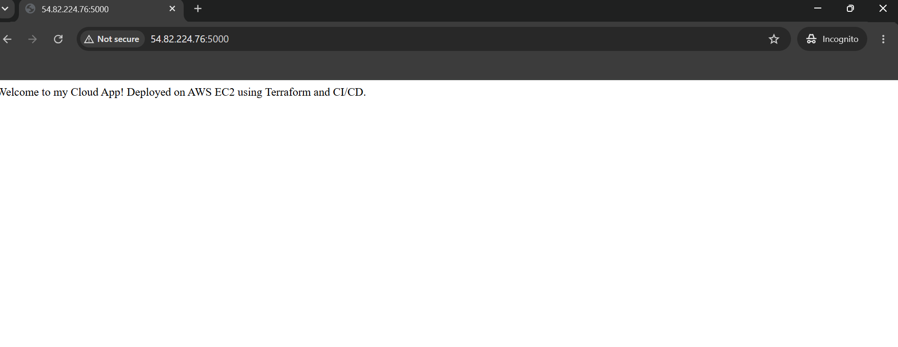
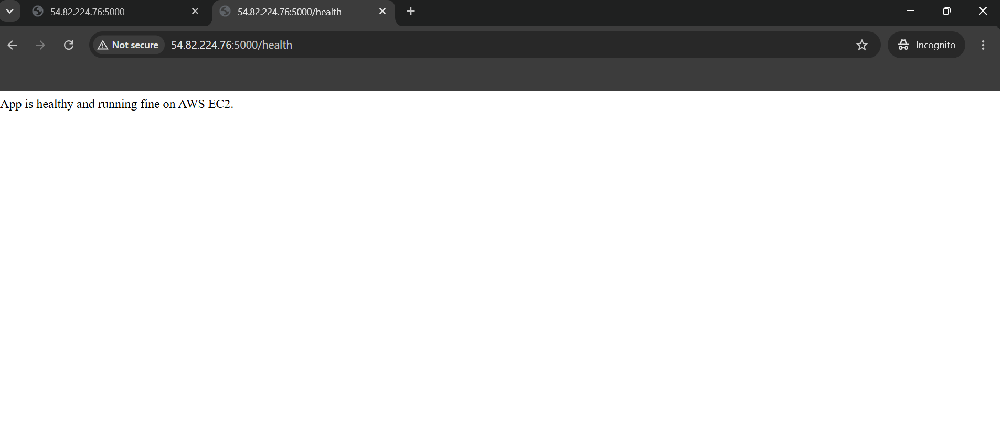
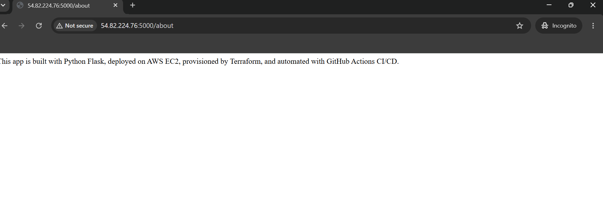
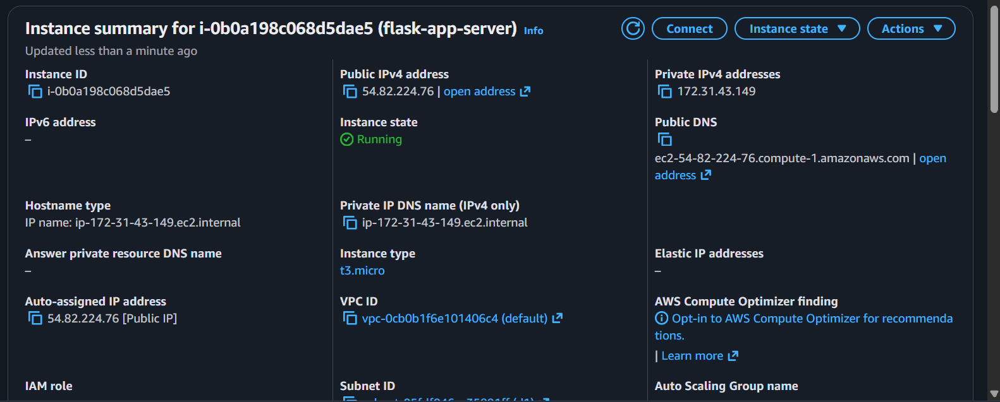
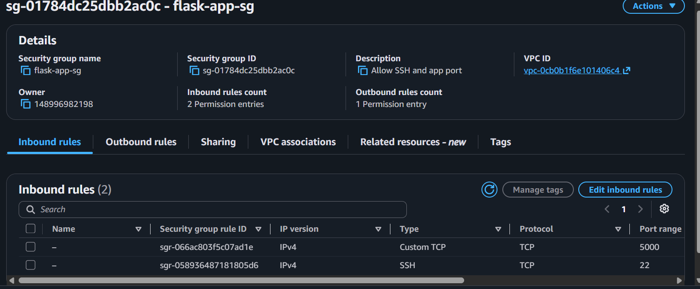

## Automated Python App Deployment on AWS EC2 with Terraform & CI/CD
A hands-on cloud project where every code push automatically goes live on AWS — no manual steps, no SSH required. Built with Flask, provisioned with Terraform, and deployed through a GitHub Actions pipeline.

## Tools&Technologies 
- Python (Flask) —  Built a simple web app with three routes
- AWS EC2 — used EC2 as the cloud server to host and run the app
- Terraform — Wrote infrastructure as code to provision all AWS resources automatically
- Linux (Amazon Linux) — Configured the server and ran Flask as a systemd background service
- GitHub Actions — A CI/CD pipeline that deploys automatically on every push

## Architecture
```
Developer pushes code
        ↓
    GitHub Repo
        ↓
  GitHub Actions (CI/CD Pipeline)
        ↓
  Copies app.py to EC2 
        ↓
  Restarts Flask service 
        ↓
  Live app updated on AWS EC2
  ```

## Infrastructure (Terraform)
- EC2 t3.micro (Amazon Linux) — runs the Flask app
- Security Group — opens port 22 (SSH) and port 5000 (Flask)

## Project Structure
```
aws-ec2-terraform-cicd/
├── .github/
│   └── workflows/
│       └── deploy.yml
├── app/
│   ├── app.py
│   └── requirements.txt
├── terraform/
│   ├── main.tf
│   ├── provider.tf
│   ├── security-group.tf
│   └── output.tf
├── .gitignore
└── README.md
```

## Key Features
- Flask app with three routes: /, /health, /about
- Terraform provisions EC2 and Security Group automatically
- Flask app runs as a systemd background service (survives reboots)
- GitHub Actions pipeline triggers on every push to main branch
- Automatic file copy and service restart on each deployment

## Setup Instructions
Before you start:
- AWS account with IAM user (AdministratorAccess)
- AWS CLI installed and configured (aws configure)
- Terraform installed
- Python 3 installed
- GitHub account

* Step 1: Clone the repo
 Clone the project to the local machine and move into the project folder:
 git clone https://github.com/sansreebrama33-wq/aws-ec2-terraform-cicd.git
 cd aws-ec2-terraform-cicd

* Step 2: Create EC2 Key Pair
 Created a key pair to SSH into the EC2 instance.
- Go to AWS Console → EC2 → Key Pairs → Create key pair
- Name- my-ec2-key, type RSA, format .pem
- Move the downloaded .pem file into the terraform/ folder

* Step 3: Set Up AWS Resources with Terraform
 Used these commands to create the EC2 instance and Security Group on AWS:
 - cd terraform
 - terraform init
 - terraform plan
 - terraform apply

* Step 4: Set up Flask app on EC2
 SSH into the EC2 instance and set up the app as a background service:
 commands used-
- ssh -i my-ec2-key.pem ec2-user@<your-ec2-ip>
- sudo yum install -y python3-pip
- pip3 install flask
- nano app.py
- sudo nano /etc/systemd/system/flaskapp.service
- sudo systemctl daemon-reload
- sudo systemctl enable flaskapp
- sudo systemctl start flaskapp
- sudo systemctl status flaskapp

* Step 5: Add GitHub Secrets
The CI/CD pipeline needs EC2 IP and SSH key to connect to the server.
- Go to GitHub repo → Settings → Secrets and variables → Actions
- Add EC2_HOST → your EC2 public IP (from Step 3 output)
- Add EC2_SSH_KEY → open my-ec2-key.pem, select all, copy and paste the entire content

* Step 6: Push code and trigger pipeline
Every time code is pushed to main, the pipeline runs automatically and deploys the latest changes.
- git add .
- git commit -m "Deploy Flask app"
- git push origin main
Check the Actions tab on GitHub to monitor the pipeline. Green means the app is live with the latest changes.

## CI/CD Pipeline
The .github/workflows/deploy.yml pipeline:
- Triggers automatically on every push to main
- Copies the latest app.py to EC2 via SCP
- Restarts the Flask service via SSH
- Confirms deployment by printing service status

## Screenshots
* Live App:


* Health Route:


* About Route:


* GitHub Actions Pipeline:


* EC2 Instance Running on AWS


* Security Group Inbound Rules


## Key Learning 
- How to provision AWS infrastructure using Terraform
- How to deploy a Python Flask app on a Linux EC2 server
- How to run an app as a background service using systemd
- How to set up a CI/CD pipeline using GitHub Actions
- How to securely connect GitHub Actions to EC2 using SSH keys
- How to debug pipeline errors and fix SSH connection issues

## Conclusion
This project gave me real hands-on experience with the full cloud deployment lifecycle. From writing a Python app locally, to provisioning AWS infrastructure with Terraform, to automating deployments with GitHub Actions — every step taught me something new. I now have a much better understanding of how modern DevOps pipelines work in real environments.

                       *************************************************************************


